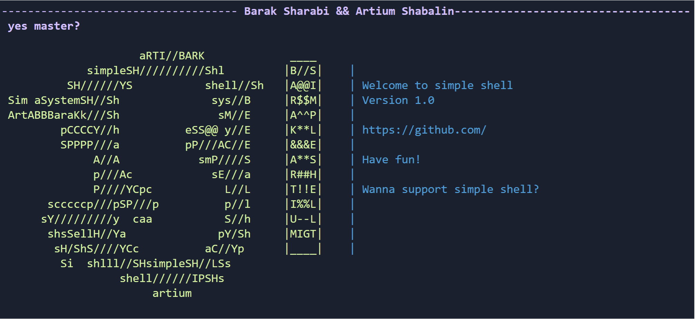

# Simple_Shell
First assigment in Operating Systems course



## Running Programm:
```bash
# Clone the repository
$ git clone https://github.com/MightyArty/Simple_Shell.git
# Go into the repository
$ cd Simple_Shell
# Open the terminal on Linux
$ Run "make"
$ Run Server "make run"
$ Run Shell "make cmd"V
```